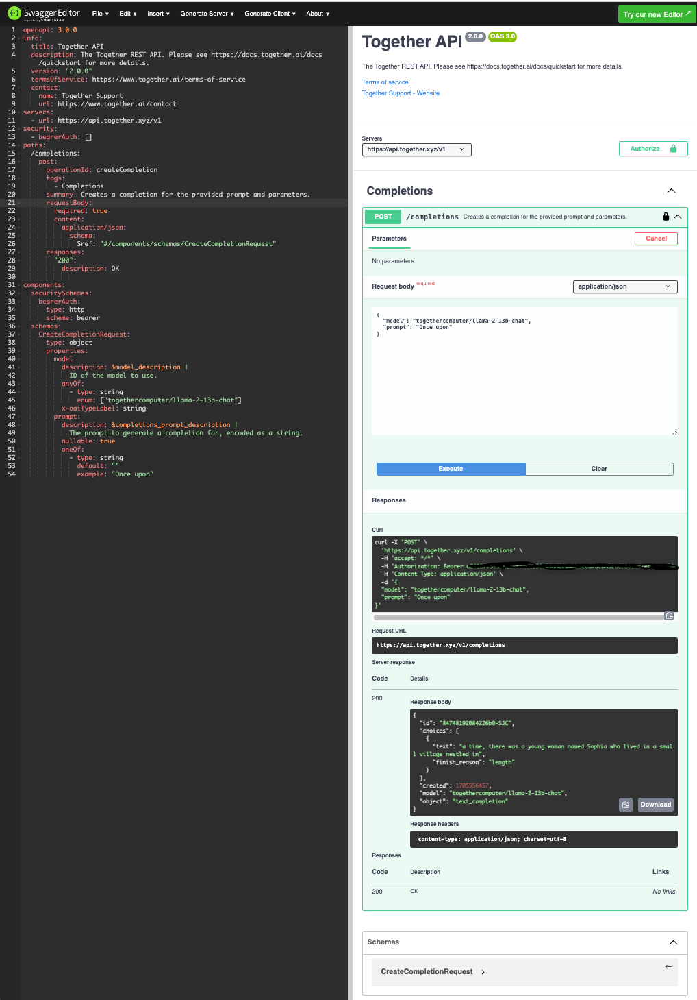

# openapi
An OpenAPI API specifications file describes an API in its entirety and  are typically written in YAML or JSON. including: Endpoints: which are available (/users) and operations on each (GET /users, POST /users) Authentication methods. Operation parameters for each operation (Input and output)

## Swagger UI

go to https://editor.swagger.io/ and under `File`, click `Import file` to import the `openai.yaml` file or just paste the yaml contents into the text editor on the left.

Copy paste your `TOGETHER_API_KEY` into the `Authorize` button on the upper right and this will turn our API into a working control panel that lets you make requests to our API. 

